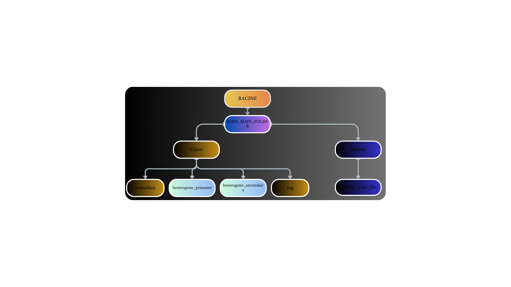

# IDFS
is a simulation of the architecture of hdfs trying to save the main componenets to build a file system personalized
---

## Project Architecture :

---


---

## Setup Instructions

Follow these steps to set up the project locally:

1. Clone the repository:
   ```bash
   git clone https://github.com/JawadData/patents_analysis.git
   
2. Change to the **master** directory:
   ```bash
   cd master
  
3. Run the registration script:
   ```bash
   python RUN-ID1FS.py

 

  
